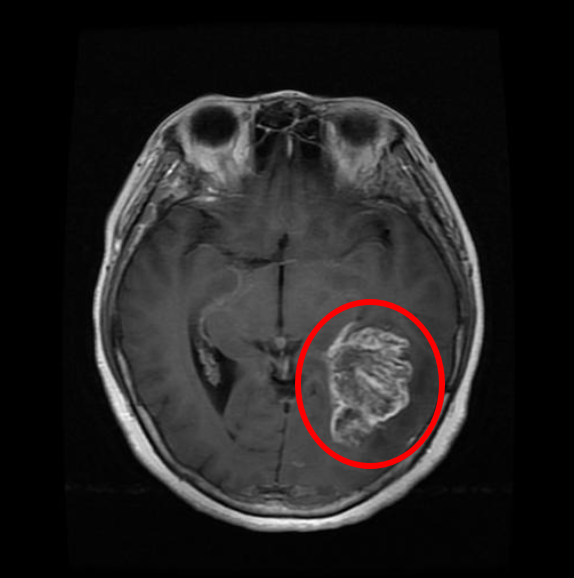
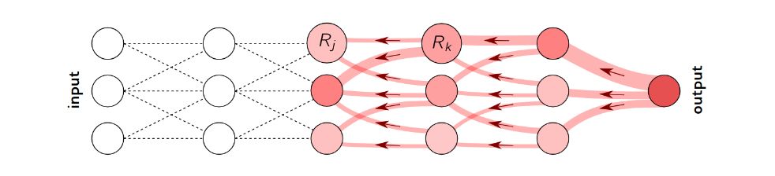

# Explainable-AI - Post-Hoc Analysis

## Task description
Creation of a CNN for brain tumor detection and application of Layer-wise Relevance Propagation (LRP) to analyse the relevance of each node for network decision-making to find out which patterns helped in detection.

## Dataset
The dataset for training and testing can be found on [kaggle](https://www.kaggle.com/datasets/preetviradiya/brian-tumor-dataset?resource=download).\
The dataset must be placed in the working directory as follows:
```
XAI-BrainTumor
├── brain-tumor-dataset
│   ├── Brain-Tumor
│   │   ├── Cancer (1).jpg
│   │   ├── Cancer (2).jpg
│   │   ...
│   └── Healthy
│       ├── Not Cancer  (1).jpg
│       ├── Not Cancer  (2).jpg
│       ...
├── main.ipynb
...
```

## Project
### Introduction
A brain tumor is an abnormal growth of cells in the brain. [1] An example of a brain tumor is shown in the image below on the right side of the brain, toward the center and slightly back. There you can see the large, well-defined mass.



This image was taken with an MRI. A brain MRI is a painless test that produces very clear images of the structures inside your head - mainly your brain. Healthcare providers use brain MRIs to evaluate, diagnose, and monitor several different medical conditions that affect your brain or other structures in your head. [7]

### Convolutional Neural Networks (CNN)
Detecting brain tumors from MRI images is challenging due to the complex structure of the brain. [1] In this context, convolutional neural networks (CNNs) have proven effective in a wide range of computer vision tasks. Recent advances in semantic segmentation have further enabled their application to medical image segmentation. [2] The aim of this project is to understand the specific strengths and difficulties that artificial intelligence, and CNNs in particular, face in brain tumor detection.

### Layer-wise Relevance Propagation (LRP)
Although machine learning methods successfully address a wide range of tasks, they often operate as black boxes, lacking transparency about how they arrive at specific decisions. [3] To tackle this issue, we introduce a methodology that visualizes the contributions of individual pixels to predictions for kernel-based classifiers over Bag of Words features, as well as for multilayered neural networks. By generating heatmaps of these pixel contributions, human experts can intuitively verify the validity of classification decisions and focus further analysis on areas of potential interest. [3] One practical application of layer-wise relevance propagation (LRP) is assessing whether the training data is suitable for a given prediction. [4]

The process begins with a standard forward pass through the model, allowing the network to make a prediction. Then, the model's output is backward propagated layer by layer, following the neural pathways linked to the final prediction, using specific LRP decomposition rules. This results in a heatmap that indicates the contribution of individual input features (e.g., pixels) to the prediction, which can be computed for any hypothetically possible outcome. [6] Here we have an image illustrating the backward propagation:\
 [9]

More details about the specific implementation of LRP can be found in ``lrp_explained.md`` in the lrp package.

### Structure
The structure of the project and the purpose of the files are as follows: 
```
XAI-BrainTumor
├── brain-tumor-dataset      // Images of brain tumors and healthy brains
│   ├── Brain-Tumor
│   │   ...
│   └── Healthy
│       ...
├── images-documentation     // Images used for the various documentation files
│   ...
├── lrp                      // Package containing the code for the lrp    
│   ├── __init__.py
│   ├── lrp.py
│   ├── lrp_filter.py
│   ├── lrp_layers.py
│   └── lrp_layers.py        // Documentation explaining the LRP implementation
├── saved-net
│   └── cifar_net.pth        // File with the trained net
├── main.ipynm               // Main where the CNN is built and the LRP is done
└── README.md
```

### Course of the project
The next steps, i.e. building the CNN and running the LRP with analysis and conclusion, will all be done and explained in ``main.ipynb``.

## Inspiration for the project
* [Training a Classifier](https://pytorch.org/tutorials/beginner/blitz/cifar10_tutorial.html)
* Exercise from chapter "07 CNN Explainability" of my XAI lecture
* [PyTorchRelevancePropagation by kaifishr](https://github.com/kaifishr/PyTorchRelevancePropagation)
* [lrp_toolbox](https://github.com/sebastian-lapuschkin/lrp_toolbox)

## List of references
* [1] [Image Processing Techniques for Brain Tumor Detection: A Review](https://d1wqtxts1xzle7.cloudfront.net/40014067/IJETTCS-2015-10-01-7-libre.pdf?1447569226=&response-content-disposition=inline%3B+filename%3DImage_Processing_Techniques_for_Brain_Tu.pdf&Expires=1732787103&Signature=F2~tywWaIuTf0XXNDVScYlEQgee8b1217Rm8Zhw9KqWc9CGPjEsdJloSP0STUU~0wHc6HsjsBXQbYoBZUfHDFM~YTXkZJO3-pPNGkgJQIMmlraEcINHVU0O2mMRvzkGStvPzHw5cA3QfSuYolTAxsoITc~8hGCSgYibms8EWEIBuVuU6o53qdeCkKO8hEkdJ-l7KyuyLWzd1MAWF8vDmsr7lSY9pArTw248jMknpsnblIEFWkXjYQbatFyTKPDLCaP9dbLz33qm7oDj5UQfkEVzOIRYe1Z3KO48NLRnRpB~8y7ZsVeg488171NLvyt6rAckpjkyBCSEDN8fEjfph1A__&Key-Pair-Id=APKAJLOHF5GGSLRBV4ZA)
* [2] [CNN-based Segmentation of Medical Imaging Data](https://arxiv.org/abs/1701.03056)
* [3] [On Pixel-Wise Explanations for Non-Linear Classifier Decisions by Layer-Wise Relevance Propagation](https://journals.plos.org/plosone/article?id=10.1371/journal.pone.0130140)
* [4] [Layer-Wise Relevance Propagation for Deep Neural Network Architectures](https://link.springer.com/chapter/10.1007/978-981-10-0557-2_87)
* [5] [Magnetic Resonance Imaging (MRI)](https://stanfordhealthcare.org/medical-tests/m/mri.html)
* [6] [Layer-wise Relevance Propagation](https://www.hhi.fraunhofer.de/en/departments/ai/technologies-and-solutions/layer-wise-relevance-propagation.html)
* [7] [Brain MRI](https://my.clevelandclinic.org/health/diagnostics/22966-brain-mri)
* [8] [Towards Best Practice in Explaining Neural Network Decisions with LRP](https://ieeexplore.ieee.org/abstract/document/9206975?casa_token=4zn67b_jdRAAAAAA:2C8hjdI6kPFGolboHiq45EB_PbBqyYfaFzoOzrQ_rd0WnmeTphoSqHW8IJnRv6fZZp1Z3ec1OHDrIw)
* [9] [Layer-Wise Relevance Propagation: An Overview](https://link.springer.com/chapter/10.1007/978-3-030-28954-6_10)
* [10] [Interpreting the Predictions of Complex ML Models by Layer-wise Relevance Propagation](https://arxiv.org/abs/1611.08191)
* [11] [Explaining Convolutional Neural Networks using Softmax Gradient Layer-wise Relevance Propagation](https://ieeexplore.ieee.org/abstract/document/9022542?casa_token=Jr0_Y1q9KhwAAAAA:EE01aDSgMNfjraiSKvpdShpe8YDZ61Wnx8Hs8kTM7SIloiywQH9pBV_a_1vfFQVcj8yAtJl0nf_afw)
* [12] [Brain Cancer Screening](https://www.moffitt.org/cancers/brain-cancer/diagnosis/screening/)