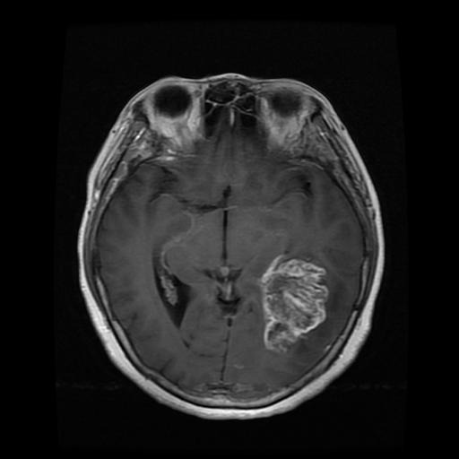

# Explainable-AI - Post-Hoc Analyse

## Task description
Creation of a CNN for brain tumour detection and application of Layer-wise Relevance Propagation (LRP) to analyse the relevance of each node for network decision making to find out which patterns helped in detection.

## Dataset
The dataset for training and trying can be found on [kaggle](https://www.kaggle.com/datasets/preetviradiya/brian-tumor-dataset?resource=download).
The dataset needs to be placed in the workng directory like this:
```
XAI-BrainTumor
├── brain-tumor-dataset
│   ├── Brain-Tumor
│   │   ├── Cancer (1).jpg
│   │   ├── Cancer (2).jpg
│   │   ...
│   └── Healthy
│       ├── Not Cancer  (1).jpg
│       ├── Not Cancer  (2).jpg
│       ...
├── main.ipynb
...
```

## Project
### Introduction
Brain tumor is an abnormal growth of cell of brain. [1]\
The brain tumor is on the right side of the brain, towards the middle and slightly back. There you can see the large, well-defined mass.\


### Convolutional Neural Networks (CNN)
Brain tumor detections are using MRI images is a challenging task, because the complex structure of the brain. [1] The goal of this project is to understand, what makes it so hard to detect the tumor for an artificial intelligence, especialy a CNN.

Convolutional neural networks have been applied to a wide variety of computer vision tasks. Recent advances in semantic segmentation have enabled their application to medical image segmentation. [2]

### Layer-wise Relevance Propagation (LRP)
 Although machine learning methods are solving very successfully a plethora of tasks, they have in most cases the disadvantage of acting as a black box, not providing any information about what made them arrive at a particular decision. [3]
We introduce a methodology that allows to visualize the contributions of single pixels to predictions for kernel-based classifiers over Bag of Words features and for multilayered neural networks. These pixel contributions can be visualized as heatmaps and are provided to a human expert who can intuitively not only verify the validity of the classification decision, but also focus further analysis on regions of potential interest. [3]

One application of layer-wise relevance propagation is the assessment whether the training data is appropriate for a prediction. [4]

### Structure
```
XAI-BrainTumor
├── brain-tumor-dataset
│   ├── Brain-Tumor
│   │   ...
│   └── Healthy
│       ...
├── images-documentation
│   ...
├── lrp
│   ├── __init__.py
│   ├── lrp.py
│   ├── lrp_filter.py
│   └── lrp_layers.py
├── saved-net
│   └── cifar_net.pth
├── main.ipynm
└── README.md
```

### Course of the project
The next steps, i.e. building the CNN and running the LRP with analysis and conclusion, will all be done and explained in ``main.ipynb``.

## Inspiration for the project
* [Training a Classifier](https://pytorch.org/tutorials/beginner/blitz/cifar10_tutorial.html)
* [PyTorchRelevancePropagation by kaifishr](https://github.com/kaifishr/PyTorchRelevancePropagation)
* [lrp_toolbox](https://github.com/sebastian-lapuschkin/lrp_toolbox)

## Literaturverzeichnis
* [1] [Image Processing Techniques for Brain Tumor Detection: A Review](https://d1wqtxts1xzle7.cloudfront.net/40014067/IJETTCS-2015-10-01-7-libre.pdf?1447569226=&response-content-disposition=inline%3B+filename%3DImage_Processing_Techniques_for_Brain_Tu.pdf&Expires=1732787103&Signature=F2~tywWaIuTf0XXNDVScYlEQgee8b1217Rm8Zhw9KqWc9CGPjEsdJloSP0STUU~0wHc6HsjsBXQbYoBZUfHDFM~YTXkZJO3-pPNGkgJQIMmlraEcINHVU0O2mMRvzkGStvPzHw5cA3QfSuYolTAxsoITc~8hGCSgYibms8EWEIBuVuU6o53qdeCkKO8hEkdJ-l7KyuyLWzd1MAWF8vDmsr7lSY9pArTw248jMknpsnblIEFWkXjYQbatFyTKPDLCaP9dbLz33qm7oDj5UQfkEVzOIRYe1Z3KO48NLRnRpB~8y7ZsVeg488171NLvyt6rAckpjkyBCSEDN8fEjfph1A__&Key-Pair-Id=APKAJLOHF5GGSLRBV4ZA)
* [2] [CNN-based Segmentation of Medical Imaging Data](https://arxiv.org/abs/1701.03056)
* [3] [On Pixel-Wise Explanations for Non-Linear Classifier Decisions by Layer-Wise Relevance Propagation](https://journals.plos.org/plosone/article?id=10.1371/journal.pone.0130140)
* [4] [Layer-Wise Relevance Propagation for Deep Neural Network Architectures](https://link.springer.com/chapter/10.1007/978-981-10-0557-2_87)
* [5] [Magnetic Resonance Imaging (MRI)](https://stanfordhealthcare.org/medical-tests/m/mri.html)