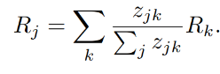
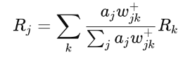

# LRP 
For the explanation of the implemented LRP, we will mainly use chapter 10 [Layer-Wise Relevance Propagation: An Overview](https://link.springer.com/chapter/10.1007/978-3-030-28954-6_10) from the book [Explainable AI: Interpreting, Explaining and Visualizing Deep Learning](https://link.springer.com/book/10.1007/978-3-030-28954-6).

## Quick Overview
Layer-Wise Relevance Propagation (LRP) explains neural network like CNNs predictions by propagating the output backward using specially designed propagation rules. The aim is to redistribute the model's prediction f(x) across the input features.

## LRP implementation
The LRP package consists of the following four files. 

### \_\_init__.py
Files named \_\_init__.py are used to mark directories on disk as Python package directories. This is done so that lrp can be imported into the main Jupyter notebook.

### lrp.py
LRP aims to explain predictions ``f(x)`` of a neural network by redistributing the output relevance backward through the layers. At each layer, a conservation property ensures that the relevance scores received by a neuron are fully redistributed to the preceding layer. This is mathematically formalized as:

#### Main Components:
The ``LRPModel`` class converts a pre-trained model into its LRP equivalent through these methods:

1. **LRP Model Structure**:\
``_get_layer_operations()``: Extracts the sequential layers from the original model.

2. **Custom LRP Layers**:\
``_create_lrp_model()``: Reverses the layer sequence and replaces them with their LRP counterparts. The different ``RelevancePropagation*`` classes wrap standard PyTorch layers (e.g., Conv2d, Linear) to support relevance propagation. More on them in ``lrp_layers.py``. 

3. **Forward and Relevance Propagation**:\
The ``forward()`` method computes activations in a standard forward pass. The relevance scores are then propagated backward using the modified layers. This is implemented by reversing activations and applying the LRP layers sequentially backward: ``activations = activations[::-1]``

### lrp_layers.py
Here can be found the layers for LRP.

#### RelevancePropagationConv2d
Uses the z^+-rule:\

By clamping weights to non-negative values (``self.layer.weight.clamp(min=0.0)``), it ensures that only positive contributions propagate relevance. It also adds a small constant ϵ to the activations to ensure numerical stability during division.

#### RelevancePropagationLinear
Similar to RelevancePropagationConv2d, uses the z^+-rule for fully connected layers.

#### RelevancePropagationFlatten
Reshapes the relevance scores to match the input activations. Since flattening layers do not modify the values, this operation preserves the relevance distribution without altering its computation.

#### RelevancePropagationReLU
Passes relevance through without modification. This aligns with the identity property of ReLU in the backward pass since it does not alter the relevance but just propagates it.

### lrp_filter
The relevance_filter method introduces sparsity by retaining only the top k% of relevance scores, reducing noise and improving interpretability. Although not part of the core LRP, this mechanism corresponds to the goal of the paper to produce clearer explanations. Both the ``Conv2d`` and ``Linear`` layers apply a ``relevance_filter()``.

How It Works:
1) Flattens the relevance scores.
2) Selects the top k% values using torch.topk.
3) Sets all other values to zero.
4) Reshapes the tensor to its original dimensions.

This practical extension enhances the relevance maps by focusing on the most critical features.